# Table of Contents

1.  [Creating a virtual machine](#org1677977)
    1.  [Google cloud](#org2ce269d)
        1.  [Making account and setting up billing](#orge672a7e):ATTACH:
        2.  [Requesting GPU quota and launching virtual machine](#org224df02):ATTACH:
    2.  [Azure student sponsorship](#org34cc87e)
2.  [Connecting to servers](#org5e6856d)
    1.  [Windows](#org02a6211)
        1.  [SSH](#org5ebc47d)
            1. [Generating your keypair](#keypair)
            2. [Adding your keypair to a Google Cloud instance](#adding keypair to instance)
3. [Working with your server](#workServer)
    1.  [git](#gitServer)
    2.  [tmux](#org7e8c79b)
    3.  [Google drive](#orgb74b1e9)

<a id="org1677977"></a>

# Creating a virtual machine


<a id="org2ce269d"></a>

## Google cloud


<a id="orge672a7e"></a>

### Making account and setting up billing     :ATTACH:

1.  Make an account using your credit card info with this link <https://cloud.google.com/free>, if everything went alright you will be greeted by the google cloud home screen.

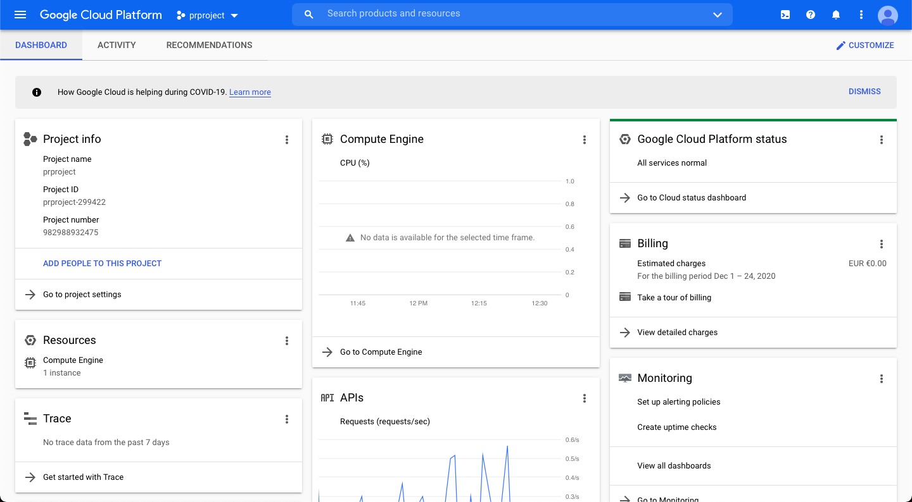

2.  On the home screen there is a search bar, type: `billing`, it should show a screen similar to this one, which is the most important to us!:

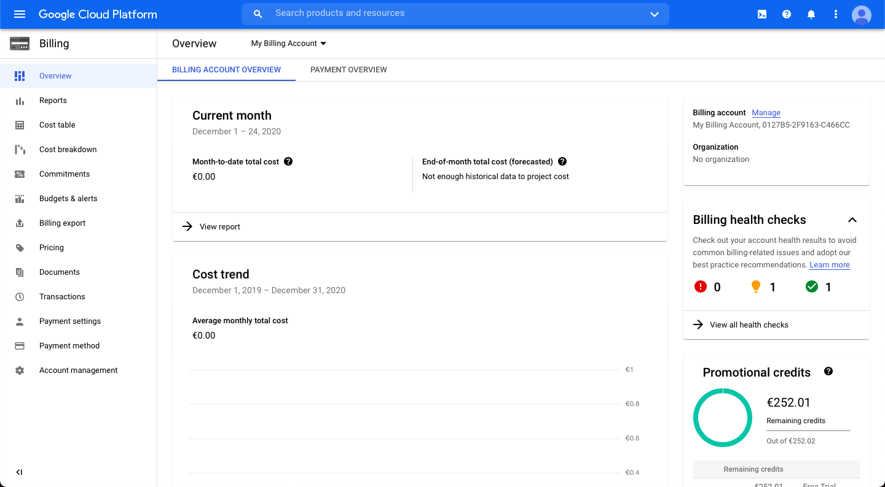

3.  In the bottom right you should see an option to upgrade your account to a paid account, we need this because otherwise we are locked out of requesting GPUs. Click it, and you should see a message reassuring that you will only start paying once your usage exceeds the 250 free trial credits.

4.  On the billing screen we also see health checks, click `View all health checks`. You should see this screen.
    
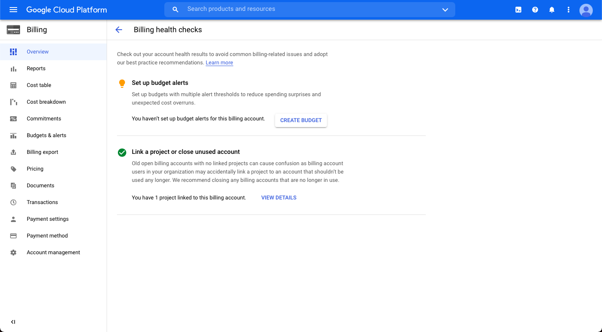

5.  Click on create budget, you will need to give your budget a name and specify an amount. I gave the following `prproj` and `250`. Follow the default options for other steps. **In this way you will be alerted via email when your spending exceeds 50, 90 and 100 percent, but does NOT put a hard cap on your budget.**

6.  For hard caps and automatic instance stopping we need to do extra steps from <https://cloud.google.com/billing/docs/how-to/notify#functions_billing_auth-python>


<a id="org224df02"></a>

### Requesting GPU quota and launching virtual machine     :ATTACH:

1.  Now that we have our account ready, we can request GPUs. Type: `all quota` into the search bar. You should see a screen like this (note that I already did these steps):

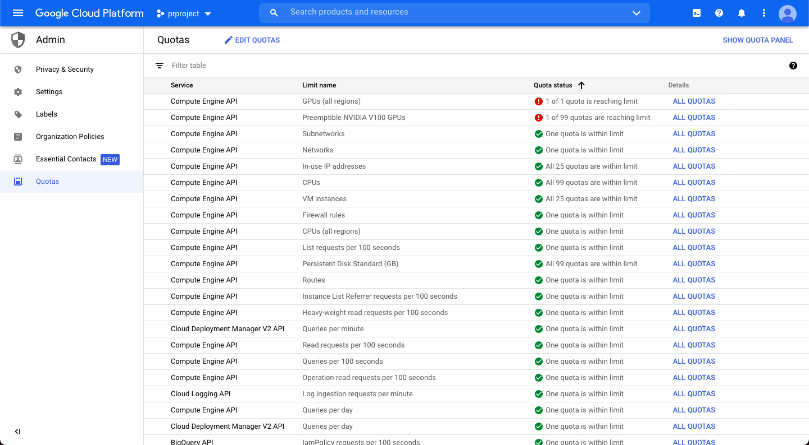

2.  The important quota is `GPUs (all regions)` which is 0 by default. I requested 1 GPU by doing the following, but maybe we can do more. First use the `filter table` by clicking on the icon, and selecting metric from the drop down menu. Then type `gpus_all_regions.`

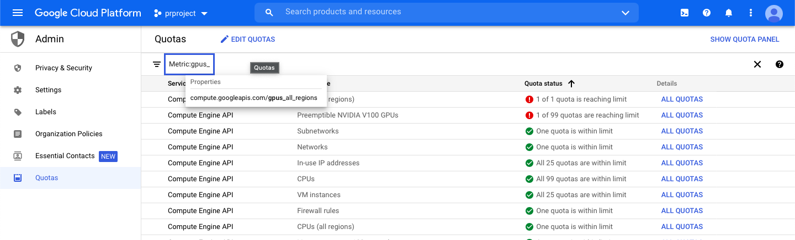

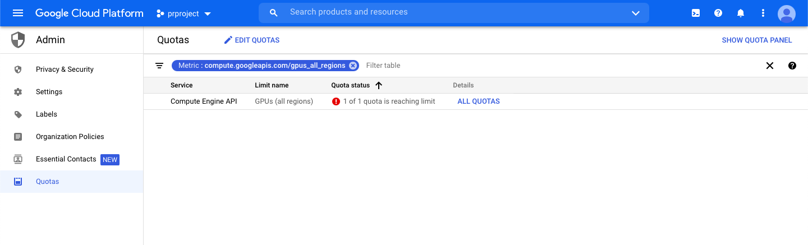

3.  In the GPUs (all regions) quota row click `ALL QUOTAS`,
    
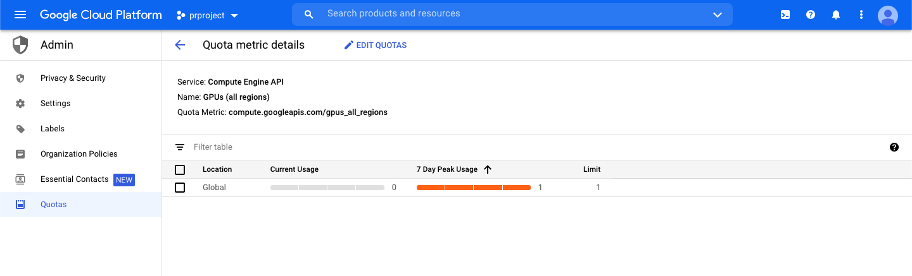

tick the box, and then click `EDIT QUOTAS`,


this is the important screen, fill in the number of GPUs you want, fill in a request motivation (I put Utrecht University masters student), and click `NEXT`.

4.  Follow any steps, (can&rsquo;t remember) and if everything went alright you will receive an email within minutes saying your request has been approved.

5.  For more information on the following steps see: <https://cloud.google.com/ai-platform/deep-learning-vm/docs/pytorch_start_instance> and <https://cloud.google.com/compute/docs/gpus/gpu-regions-zones> (I now realised my mistake of making a GPU in asia-east, when the same is available in europe, I deleted the instance)

6.  The only way I could find to make a *preemptible* virtual machine was with the Cloud Console or the gcloud command line tool, using this link <https://cloud.google.com/ai-platform/deep-learning-vm/docs/pytorch_start_instance>. I assume you can use the gcloud command line tool here, more info could be found here <https://cloud.google.com/shell/docs/using-cloud-shell> or <https://cloud.google.com/sdk/docs/install>.

7.  The relevant code snippet that will **DEPLOY** a virtual machine right away is:
    
```sh 
export IMAGE_FAMILY="pytorch-latest-gpu"
export ZONE="europe-west4-[abc]"
export INSTANCE_NAME="my-instance"

gcloud compute instances create $INSTANCE_NAME \
  --zone=$ZONE \
  --image-family=$IMAGE_FAMILY \
  --image-project=deeplearning-platform-release \
  --maintenance-policy=TERMINATE \
  --accelerator="type=nvidia-tesla-v100,count=1" \
  --metadata="install-nvidia-driver=True" \
  --preemptible
```
    
You can change the `INSTANCE_NAME`, `IMAGE_FAMILY`, and `count` of gpus (if you have enough quota!).
    
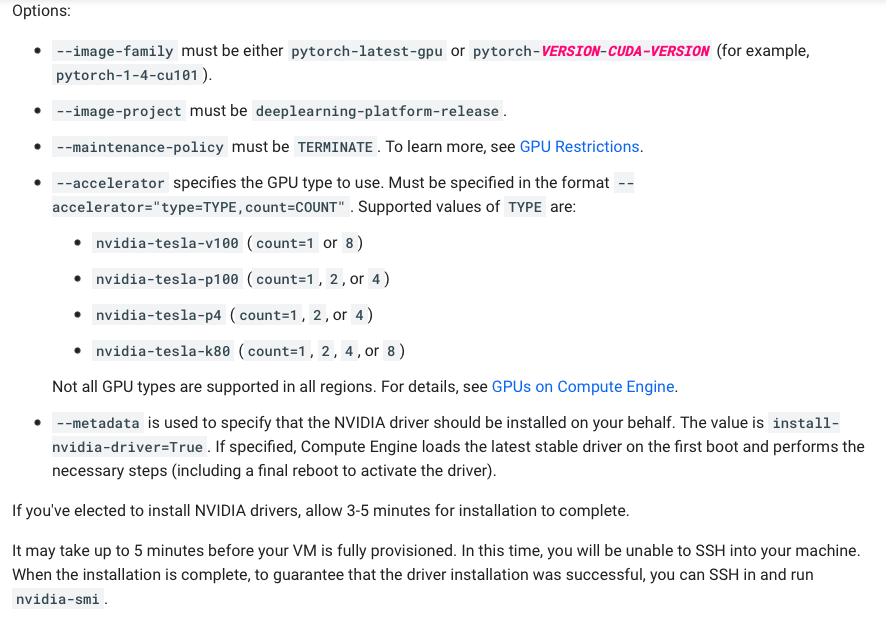

**remember to stop the instance if you will not use it right away!!!**

8. You can stop the instance by typing: `vm instances` in the search bar. Then you should see a screen with a list of your instances, running or not. Click the instance you just made and click the `stop` icon.

<a id="org34cc87e"></a>

## Azure student sponsorship


<a id="org5e6856d"></a>

# Connecting to servers


<a id="org02a6211"></a>

## Windows


<a id="org5ebc47d"></a>

### SSH into your server

<a id="org7e8c79b"></a>

#### Generating your keypair

<a id="keypair"></a>

  1. We are using this guide, <https://cloud.google.com/compute/docs/instances/connecting-advanced#windows-putty>. Download putty here <https://www.putty.org>.

2. First we need to generate the public-private ssh keypair, to do this go to (on windows): *Start* > *Programs* > *PuTTY* > *PuTTYgen*

3. Click `SSH-2 RSA` as the type of key to generate. (leave everything as is)

4. Click Generate and then move the cursor around the blank area of the Key section to generate the random characters that create a unique key. When the key has been completely generated, the information about the new key is displayed in the Key section. (Do not modify the Key fingerprint or the Key comment fields; this can cause your key to no longer be valid.)

5. Save the public key by: 1. Click Save private key. The PuTTYgen Warning panel is displayed. 2. Click Yes to save the private key without a passphrase. 3. Type icat as the name of the private key, and specify the location where you want to save the private key. For example, you can create a directory on your computer called keys to store both the public and private keys. It is recommended that you save your public and private keys in the same location.

6. Click Save.

7. Close the PuTTY Key Generator window.

#### Adding your public key to your Google Cloud instance

<a id="adding keypair to instance"></a>

1. Go to the google cloud search bar, type: `vm instances`, you should see your created instance you want to connect to.

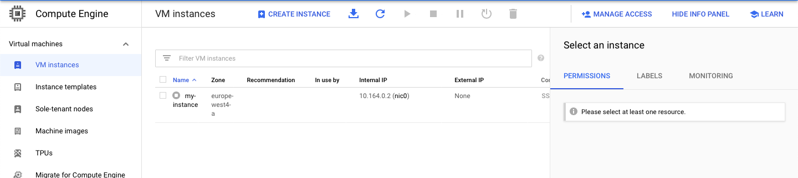

2. Click on the **name** of the instance you created to go to instance details.

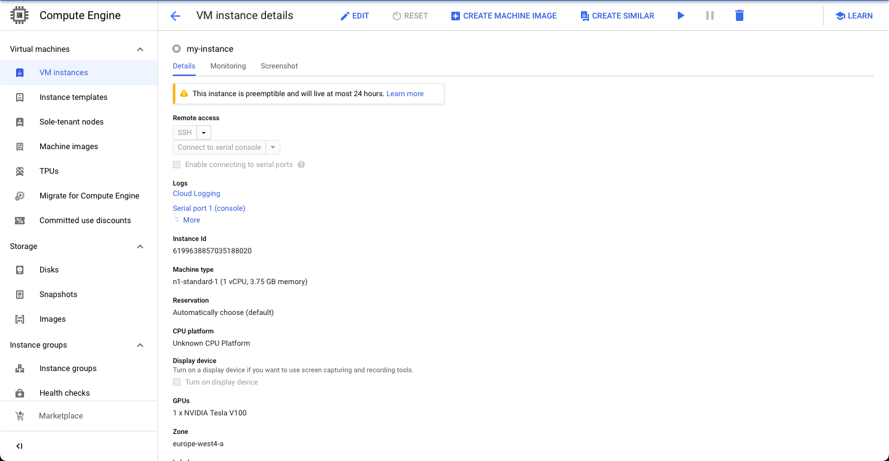

3. Then click the `edit` button. Scroll down to the SSH keys section, then paste
   the contents of your public ssh key into the box, and click add ssh key. (your public ssh key should be in a .pub file)

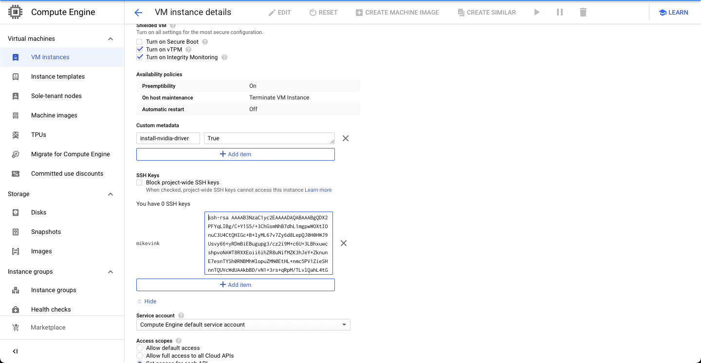

4. Click `save` at the bottom to stop editing.

#### Starting your instance and connecting using PuTTY! (the part where you can prepare to start your job)

1. 


# Working with your server

<a id="workServer"></a>

## git

<a id="gitServer"></a>

## tmux

<a id="orgb74b1e9"></a>

## Google Drive from a commandline


<a id="orgf22c3ce"></a>


